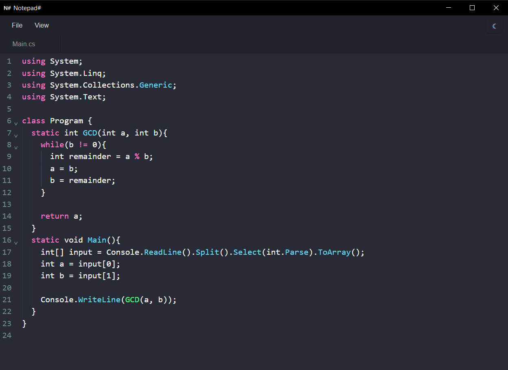

# Notepad-Sharp

Notepad-Sharp is a lightweight desktop code notepad built with Vite, TypeScript and Tauri. It focuses on fast, distraction-free editing with multi-tab support, configurable templates, theme previews and a simple remote code runner powered by the public Piston API.

Website: https://notepad-sharp.vercel.app/

**Highlights & Features**

- Multi-tab editor with drag-to-reorder, rename, save status badges and per-tab cursor/scroll restore.
- Syntax highlighting using CodeMirror 6 with language extensions (C/C++, Java, XML, basic fallbacks).
- Built-in code templates (C#, C++, Python, Java) plus custom templates editable in the Settings modal.
- Settings modal with template editing, add/delete custom templates, and theme preview/save (localStorage-backed).
- Theme support: many CodeMirror themes are available via the theme selector and previewed live.
- File operations via Tauri: open, save, rename, and file dialogs with useful filters.
- Integrated code runner modal: send code to the Piston API, provide stdin, and view formatted output (compile/runtime handling included).
- Useful editor features: undo/redo, indentation markers, fold gutter, line numbers, and zoom (font-size) controls.
- Keyboard shortcuts: Ctrl+S (save), Ctrl+O (open), Ctrl+N (new tab), Ctrl+W (close), Ctrl+Tab (next tab), Alt+N (runner), Ctrl+3/4/5/6 (insert templates), F2 (rename), +=/- zoom.

Supported/Targeted languages for templates & runner

- C# (template provided; execution shows a C# warning modal)
- C/C++
- Python
- Java
- Basic handling for XML and other filetypes (syntax fallback)
